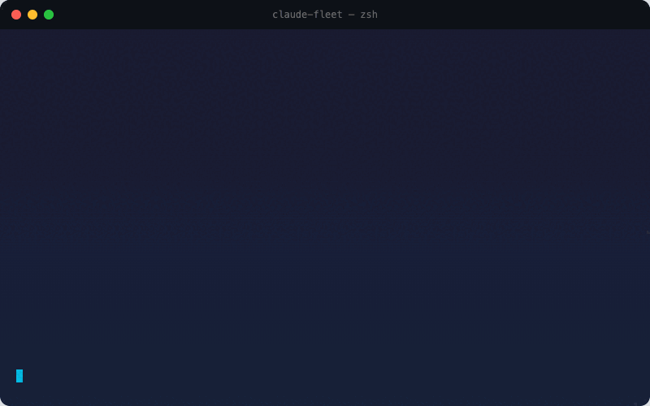
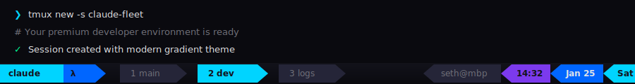

# Claude Fleet

<p align="center">
  
</p>

<p align="center">
  <strong>The infrastructure for AI agent fleets</strong>
</p>

<p align="center">
  <a href="https://github.com/sethdford/claude-fleet/actions/workflows/ci.yml"></a>
  <a href="https://www.npmjs.com/package/claude-fleet"></a>
  <a href="https://www.npmjs.com/package/claude-fleet"></a>
  <a href="https://opensource.org/licenses/MIT"></a>
  <a href="https://www.typescriptlang.org/"></a>
</p>

<p align="center">
  <a href="https://sethdford.github.io/claude-fleet/">Website</a> •
  <a href="#quick-start">Quick Start</a> •
  <a href="#features">Features</a> •
  <a href="#cli-reference">CLI Reference</a> •
  <a href="#mcp-tools">MCP Tools</a> •
  <a href="https://github.com/sethdford/claude-fleet/issues">Issues</a>
</p>

---

Orchestrate multiple Claude Code instances with intelligent coordination, swarm intelligence, and real-time collaboration. Build production-grade multi-agent systems with role-based agents aligned to the Software Development Lifecycle.

<p align="center">
  
</p>

---

## Table of Contents

- [Features](#features)
- [Quick Start](#quick-start)
- [CLI Reference](#cli-reference)
- [Dashboard](#dashboard)
- [MCP Tools](#mcp-tools)
- [Agent Roles](#agent-roles)
- [Workflows](#workflows)
- [API Reference](#api-reference)
- [Architecture](#architecture)
- [Configuration](#configuration)
- [Contributing](#contributing)

---

## Features

### Core Capabilities

| Feature | Description |
|---------|-------------|
| **Fleet Orchestration** | Spawn, manage, and coordinate multiple Claude Code worker agents |
| **Swarm Intelligence** | Blackboard messaging pattern for agent communication and coordination |
| **Git Worktrees** | Isolated workspaces for each agent to prevent conflicts |
| **Real-time Dashboard** | WebSocket-powered monitoring with live updates |
| **MCP Integration** | 25+ tools accessible via Model Context Protocol |
| **JWT Authentication** | Secure role-based access control (team-lead/worker) |
| **Prometheus Metrics** | Production-ready observability and monitoring |
| **Workflow Engine** | Define and execute multi-step workflows with dependencies |

### SDLC-Aligned Agent Roles

Claude Fleet provides 12 specialized agent roles organized by Software Development Lifecycle phase:

| Phase | Roles |
|-------|-------|
| **Discovery** | Product Analyst, Architect |
| **Development** | Frontend Dev, Backend Dev, Full-Stack Dev, Data Engineer |
| **Quality** | QA Engineer, Security Engineer, Performance Engineer |
| **Delivery** | DevOps Engineer, Tech Writer, Release Manager |

---

## Quick Start

### Installation

```bash
# Install globally via NPM
npm install -g claude-fleet

# Start the fleet server
claude-fleet

# In another terminal, use the CLI
fleet health
```

### Your First Fleet

```bash
# 1. Start the server
claude-fleet

# 2. Authenticate as team lead
fleet auth my-lead my-team team-lead
export FLEET_TOKEN="<token from above>"

# 3. Spawn a worker
fleet spawn worker-1 "Fix the authentication bug in src/auth.ts"

# 4. Check worker status
fleet workers --table

# 5. View the dashboard
open http://localhost:3847/dashboard/
```

### From Source

```bash
git clone https://github.com/sethdford/claude-fleet.git
cd claude-fleet
npm install
npm run build
npm start
```

---

## CLI Reference

The `fleet` CLI provides complete control over your agent fleet.

### Core Commands

```bash
fleet health                    # Check server health
fleet metrics                   # Get server metrics (JSON)
fleet debug                     # Get debug information
fleet auth <handle> <team> [type]  # Authenticate (team-lead|worker)
```

### Worker Management

```bash
fleet workers                   # List all workers
fleet workers --table           # List with formatted table output
fleet spawn <handle> <prompt>   # Spawn a new worker [team-lead]
fleet dismiss <handle>          # Dismiss a worker [team-lead]
fleet send <handle> <message>   # Send message to worker
fleet output <handle>           # Get worker output
```

### Git Worktree Operations

Each worker operates in an isolated git worktree for conflict-free parallel development:

```bash
fleet worktree-status <handle>            # Get worktree git status
fleet worktree-commit <handle> <message>  # Commit changes
fleet worktree-push <handle>              # Push branch to remote
fleet worktree-pr <handle> <title> <body> # Create pull request
```

### Task Management

```bash
fleet tasks <teamName>                    # List team tasks
fleet task <id>                           # Get task details
fleet task-create <to> <subject> [desc]   # Create a new task
fleet task-update <id> <status>           # Update task status
```

### Work Items & Batches

Work items provide human-readable IDs (e.g., `wi-x7k2m`) for tracking work:

```bash
fleet workitems [status]                  # List work items
fleet workitem-create <title> [desc]      # Create work item
fleet workitem-update <id> <status>       # Update status

fleet batches                             # List batches
fleet batch-create <name> [ids...]        # Bundle work items
fleet batch-dispatch <batchId> <worker>   # Assign batch to worker
```

### Communication

```bash
# Mail (async messaging)
fleet mail <handle>                       # Get unread mail
fleet mail-send <from> <to> <body> [subj] # Send mail

# Handoffs (context transfer)
fleet handoffs <handle>                   # List handoffs
fleet handoff-create <from> <to> <json>   # Transfer context
```

### Checkpoints

Workers can create checkpoints for review by team leads:

```bash
fleet checkpoints <handle>                # List checkpoints
fleet checkpoint <id>                     # Get checkpoint details
fleet checkpoint-create <h> <goal> <now>  # Create checkpoint
fleet checkpoint-accept <id>              # Accept [team-lead]
fleet checkpoint-reject <id>              # Reject [team-lead]
```

### Swarm Operations

```bash
fleet swarms                              # List all swarms
fleet swarm-create <name> <maxAgents>     # Create a swarm
fleet swarm-kill <id>                     # Kill swarm gracefully
fleet spawn-queue                         # Get spawn queue status
fleet blackboard <swarmId>                # Read blackboard messages
fleet blackboard-post <swarm> <sender> <type> <payload>
```

### Workflow Execution

```bash
fleet workflows                           # List workflows
fleet workflow <id>                       # Get workflow details
fleet workflow-start <id> [inputs]        # Start execution [team-lead]
fleet executions [status]                 # List executions
fleet execution <id>                      # Get execution details
fleet execution-pause <id>                # Pause execution
fleet execution-resume <id>               # Resume execution
fleet execution-cancel <id>               # Cancel execution
```

### Template & Role Management

```bash
fleet templates                           # List swarm templates
fleet template <id>                       # Get template details
fleet template-save <name> <json>         # Save template
fleet template-run <id>                   # Run template

fleet roles                               # List all agent roles
fleet role <name>                         # Get role details
```

---

## Dashboard

Access the real-time dashboard at `http://localhost:3847/dashboard/`

<p align="center">
  
</p>

### Dashboard Features

- **Overview** - Fleet health, active workers, task counts
- **Workers** - Real-time worker status, output, and controls
- **Tasks** - Task management and assignment
- **Swarms** - Swarm visualization and blackboard messages
- **Metrics** - Prometheus metrics and performance graphs
- **Graph View** - Visual dependency graph of agents and tasks

### Interactive Swarm Planner

Try the [Interactive Swarm Planner](https://sethdford.github.io/claude-fleet/swarm-planner-demo.html) to design your agent fleet visually.

---

## MCP Tools

Claude Fleet exposes 25+ tools via the Model Context Protocol, allowing Claude Code to orchestrate the fleet:

### Team Management
| Tool | Description |
|------|-------------|
| `team_status` | Get team status and list of online members |
| `team_broadcast` | Send a message to all team members |
| `team_tasks` | List tasks for the team |
| `team_assign` | Assign a task to a team member |
| `team_complete` | Mark a task as complete |
| `team_claim` | Claim a file to prevent conflicts |

### Worker Control
| Tool | Description |
|------|-------------|
| `team_spawn` | Spawn a new Claude Code worker instance |
| `team_dismiss` | Dismiss a worker |
| `team_workers` | List all active workers |
| `team_send` | Send a message to a specific worker |

### Work Items & Batches
| Tool | Description |
|------|-------------|
| `workitem_create` | Create a work item with human-readable ID |
| `workitem_update` | Update work item status |
| `workitem_list` | List work items with filtering |
| `batch_create` | Create a batch of work items |
| `batch_dispatch` | Dispatch batch to a worker |

### Communication
| Tool | Description |
|------|-------------|
| `mail_send` | Send mail to a worker |
| `mail_read` | Read mail messages |
| `team_handoff` | Transfer context to another worker |

### Git Operations
| Tool | Description |
|------|-------------|
| `worktree_commit` | Commit changes in worker's branch |
| `worktree_push` | Push worker's branch to remote |
| `worktree_pr` | Create pull request from worker's branch |

### MCP Configuration

Add to your Claude Code MCP settings:

```json
{
  "mcpServers": {
    "claude-fleet": {
      "command": "npx",
      "args": ["claude-fleet", "--mcp"],
      "env": {
        "CLAUDE_FLEET_URL": "http://localhost:3847",
        "FLEET_TOKEN": "your-jwt-token"
      }
    }
  }
}
```

---

## Agent Roles

### Discovery Phase

| Role | Description | Can Spawn |
|------|-------------|-----------|
| **Product Analyst** | Requirements gathering, user stories, acceptance criteria | No |
| **Architect** | System design, API contracts, architecture decisions | Yes |

### Development Phase

| Role | Description | Can Spawn |
|------|-------------|-----------|
| **Frontend Dev** | UI components, styling, client-side logic | No |
| **Backend Dev** | APIs, services, business logic | No |
| **Full-Stack Dev** | End-to-end feature implementation | Yes |
| **Data Engineer** | Database schemas, migrations, data pipelines | No |

### Quality Phase

| Role | Description | Can Spawn |
|------|-------------|-----------|
| **QA Engineer** | Test planning, test automation, bug verification | No |
| **Security Engineer** | Security review, vulnerability assessment | No |
| **Performance Engineer** | Load testing, optimization, profiling | No |

### Delivery Phase

| Role | Description | Can Spawn |
|------|-------------|-----------|
| **DevOps Engineer** | CI/CD, deployment, infrastructure | Yes |
| **Tech Writer** | Documentation, API docs, guides | No |
| **Release Manager** | Release coordination, changelog, versioning | Yes |

---

## Workflows

Define multi-step workflows with dependencies:

```yaml
name: feature-development
description: Complete feature development workflow
steps:
  - id: analyze
    name: Analyze Requirements
    role: product-analyst
    prompt: "Analyze the requirements for {{feature}}"

  - id: design
    name: Design Architecture
    role: architect
    dependsOn: [analyze]
    prompt: "Design the architecture based on {{analyze.output}}"

  - id: implement
    name: Implement Feature
    role: fullstack-dev
    dependsOn: [design]
    parallel: true
    prompt: "Implement the feature according to the design"

  - id: test
    name: Test Implementation
    role: qa-engineer
    dependsOn: [implement]
    prompt: "Test the implementation thoroughly"

  - id: deploy
    name: Deploy
    role: devops-engineer
    dependsOn: [test]
    prompt: "Deploy the feature to staging"
```

---

## API Reference

### REST Endpoints

| Method | Endpoint | Description |
|--------|----------|-------------|
| GET | `/api/health` | Health check |
| GET | `/api/metrics` | Prometheus metrics |
| POST | `/api/auth/login` | Authenticate |
| GET | `/api/workers` | List workers |
| POST | `/api/workers/spawn` | Spawn worker |
| DELETE | `/api/workers/:handle` | Dismiss worker |
| GET | `/api/tasks` | List tasks |
| POST | `/api/tasks` | Create task |
| GET | `/api/workitems` | List work items |
| POST | `/api/workitems` | Create work item |
| GET | `/api/swarms` | List swarms |
| POST | `/api/swarms` | Create swarm |
| GET | `/api/workflows` | List workflows |
| POST | `/api/workflows/:id/execute` | Execute workflow |

### WebSocket Events

Connect to `ws://localhost:3847/ws` for real-time updates:

```javascript
// Events received
{ type: 'worker:spawned', data: { handle, status } }
{ type: 'worker:dismissed', data: { handle } }
{ type: 'task:created', data: { id, subject } }
{ type: 'task:updated', data: { id, status } }
{ type: 'blackboard:message', data: { swarmId, message } }
```

---

## Architecture

```
┌─────────────────────────────────────────────────────────────────┐
│                        Team Lead                                 │
│                     (Orchestrator)                               │
└─────────────────────────┬───────────────────────────────────────┘
                          │
          ┌───────────────┼───────────────┐
          ▼               ▼               ▼
    ┌──────────┐    ┌──────────┐    ┌──────────┐
    │ Worker α │    │ Worker β │    │ Worker γ │
    │ (branch) │    │ (branch) │    │ (branch) │
    └────┬─────┘    └────┬─────┘    └────┬─────┘
         │               │               │
         └───────────────┼───────────────┘
                         │
    ┌────────────────────┼────────────────────┐
    │                    │                    │
    ▼                    ▼                    ▼
┌────────┐         ┌──────────┐         ┌──────────┐
│ SQLite │         │Blackboard│         │   Mail   │
│Storage │         │  Queue   │         │  System  │
└────────┘         └──────────┘         └──────────┘
```

---

## Configuration

### Environment Variables

| Variable | Default | Description |
|----------|---------|-------------|
| `PORT` | `3847` | Server port |
| `HOST` | `0.0.0.0` | Server host |
| `MAX_WORKERS` | `5` | Maximum concurrent workers |
| `JWT_SECRET` | (generated) | JWT signing secret |
| `STORAGE_BACKEND` | `sqlite` | Storage backend |
| `SQLITE_PATH` | `./fleet.db` | SQLite database path |
| `LOG_LEVEL` | `info` | Logging level |
| `CLAUDE_FLEET_URL` | `http://localhost:3847` | Fleet server URL |
| `FLEET_TOKEN` | - | JWT token for authentication |

### Storage Backends

Claude Fleet supports multiple storage backends:

- **SQLite** (default) - Local file-based storage
- **PostgreSQL** - Production-ready relational database
- **DynamoDB** - AWS managed NoSQL
- **Firestore** - Google Cloud managed NoSQL
- **S3** - Object storage for artifacts

### Tmux Theme

Claude Fleet includes a premium tmux configuration with a modern gradient theme designed for multi-agent development workflows.

<p align="center">
  
</p>

**Quick Install:**

```bash
# One-liner install
curl -fsSL https://raw.githubusercontent.com/sethdford/claude-fleet/main/config/install-tmux-theme.sh | bash

# Or manually
cp config/tmux.conf ~/.tmux.conf
tmux source-file ~/.tmux.conf
```

**Features:**
- Cyan → Blue → Purple gradient accent colors
- Clean tab-style window indicators
- Vim-style navigation (hjkl)
- Smart pane switching (works with vim splits)
- Session persistence with tmux-resurrect

**Fleet Status Integration:**

For real-time fleet monitoring in your status bar:

```bash
# Install with fleet integration
curl -fsSL https://raw.githubusercontent.com/sethdford/claude-fleet/main/config/install-tmux-theme.sh | bash -s -- --fleet
```

This adds:
- Live worker count (active/total)
- Active task indicator
- Swarm status display
- Fleet server health check

**Key Bindings (Prefix = Ctrl-a):**

| Key | Action | Key | Action |
|-----|--------|-----|--------|
| `\|` | Split vertical | `-` | Split horizontal |
| `h/j/k/l` | Navigate panes | `H/J/K/L` | Resize panes |
| `c` | New window | `x` | Kill pane |
| `s` | Session picker | `S` | Sync panes |
| `r` | Reload config | `[` | Copy mode |

See [config/tmux.conf](config/tmux.conf) for the basic theme, or [config/tmux-fleet.conf](config/tmux-fleet.conf) for fleet integration.

---

## Contributing

Contributions are welcome! Please see [CONTRIBUTING.md](CONTRIBUTING.md) for guidelines.

```bash
# Development
npm run dev          # Start with hot reload
npm test             # Run unit tests
npm run e2e          # Run E2E tests
npm run lint         # Lint code
npm run typecheck    # TypeScript check
```

---

## License

MIT License - see [LICENSE](LICENSE) for details.

---

<p align="center">
  <a href="https://sethdford.github.io/claude-fleet/">Website</a> •
  <a href="https://www.npmjs.com/package/claude-fleet">NPM</a> •
  <a href="https://github.com/sethdford/claude-fleet">GitHub</a>
</p>
