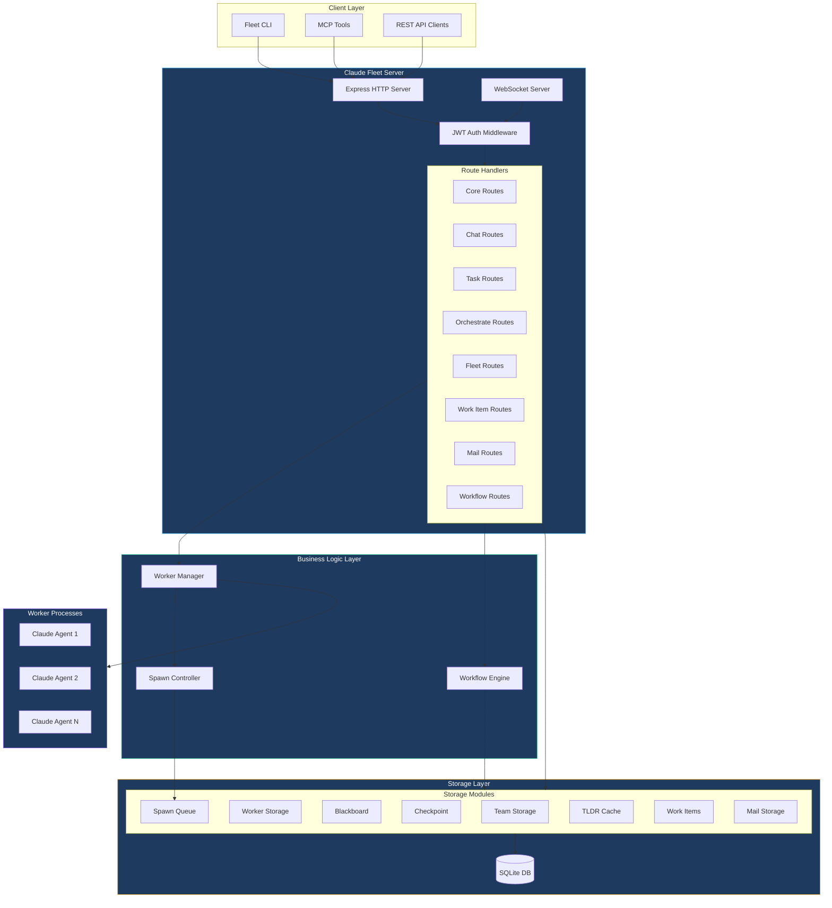
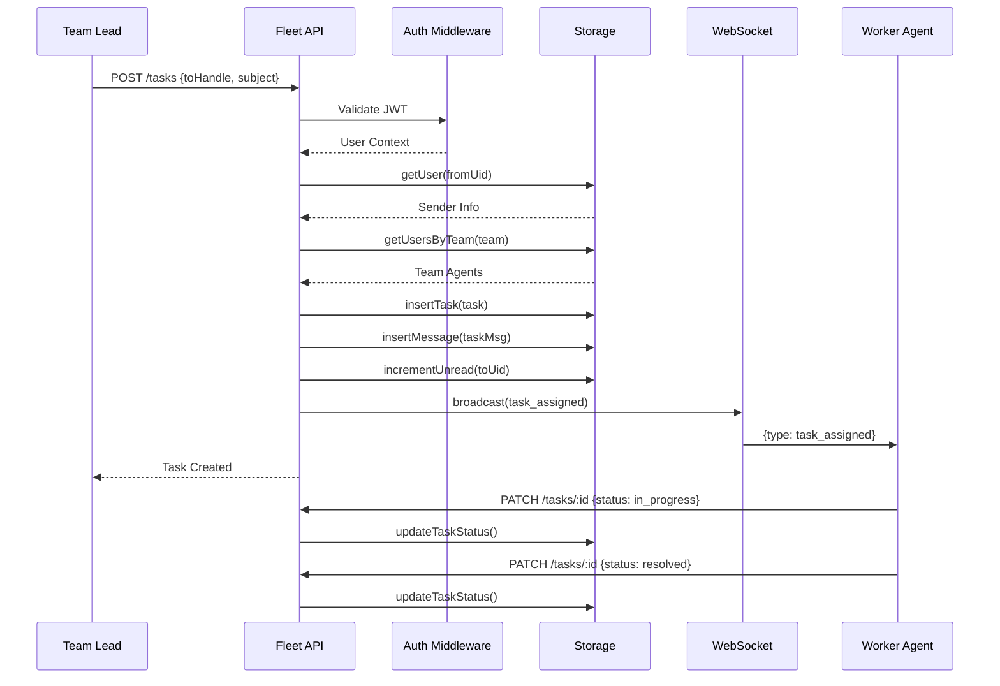
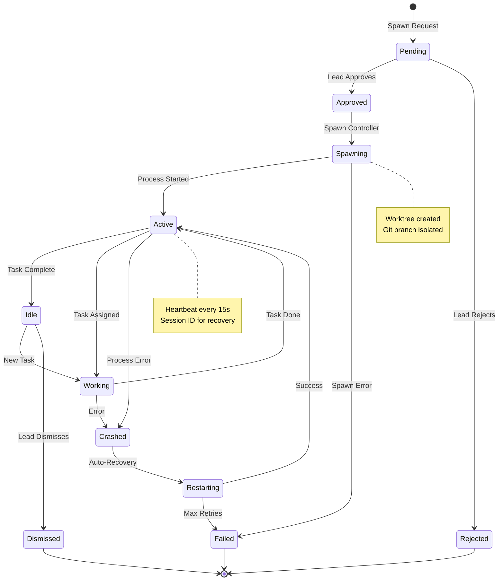
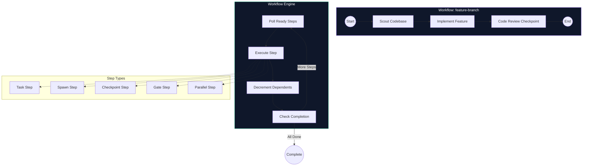
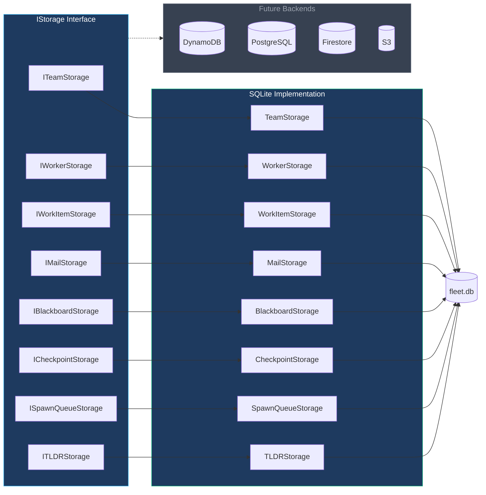
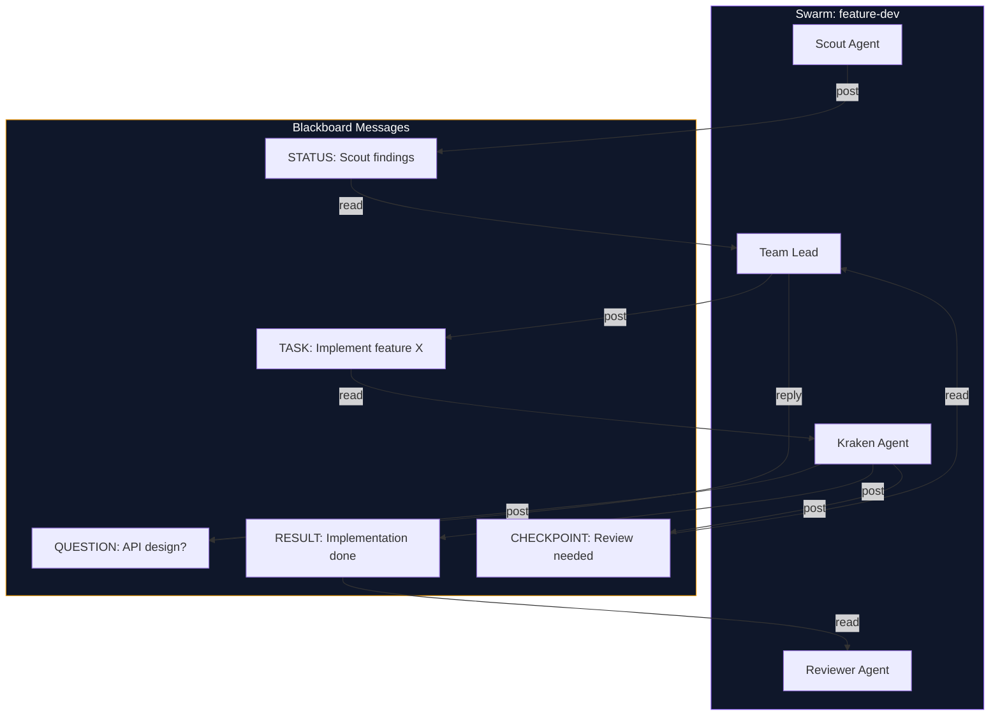
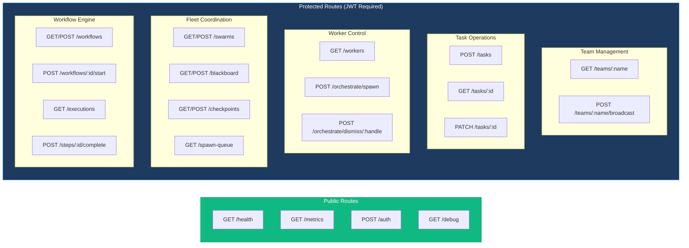
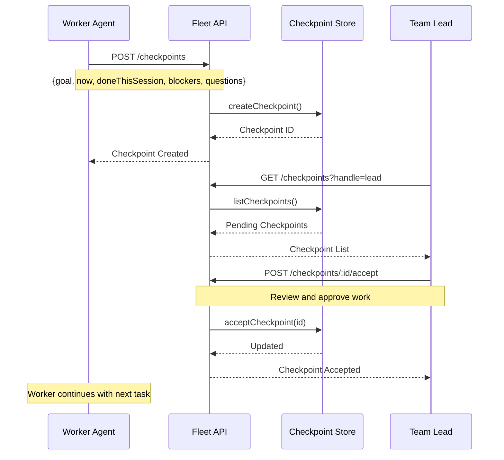
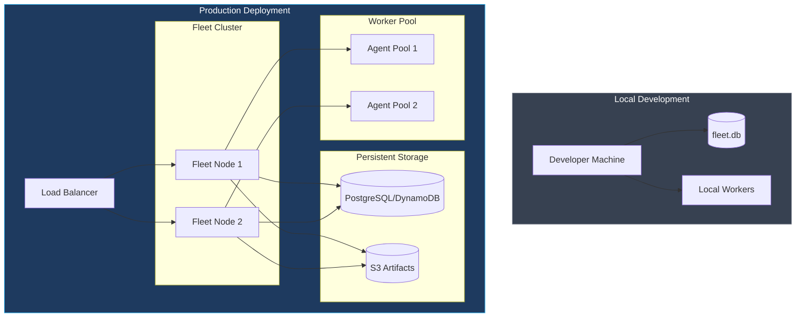
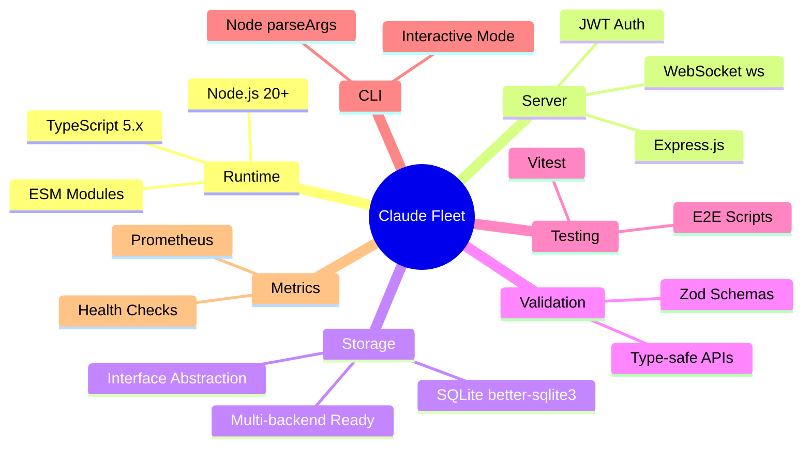

# Claude Fleet - Architecture Diagrams

> Visual documentation for the multi-agent orchestration system

---

## System Overview



---

## Data Flow: Task Assignment



---

## Worker Lifecycle



---

## Workflow Engine (DAG Execution)



---

## Storage Architecture



---

## Blackboard Communication



---

## API Route Structure



---

## Checkpoint Flow



---

## Deployment Architecture



---

## Technology Stack



---

## File Structure

```
claude-collab-local/
├── src/
│   ├── index.ts              # Entry point
│   ├── server.ts             # HTTP/WS server
│   ├── cli.ts                # CLI tool
│   ├── types.ts              # Type definitions
│   │
│   ├── routes/               # API route handlers
│   │   ├── core.ts           # Health, auth, metrics
│   │   ├── chats.ts          # Teams, chats, messages
│   │   ├── tasks.ts          # Task CRUD
│   │   ├── orchestrate.ts    # Worker spawn/dismiss
│   │   ├── fleet.ts          # Blackboard, checkpoints
│   │   ├── workitems.ts      # Work items, batches
│   │   ├── mail.ts           # Inter-agent mail
│   │   ├── workflows.ts      # Workflow engine
│   │   └── tldr.ts           # Code analysis cache
│   │
│   ├── storage/              # Data persistence
│   │   ├── sqlite.ts         # SQLite implementation
│   │   ├── interfaces.ts     # Storage contracts
│   │   ├── blackboard.ts     # Swarm messaging
│   │   ├── checkpoint.ts     # Progress snapshots
│   │   ├── spawn-queue.ts    # Worker queue
│   │   ├── tldr.ts           # File summaries
│   │   └── workflow.ts       # Workflow state
│   │
│   ├── workers/              # Worker management
│   │   ├── manager.ts        # Process lifecycle
│   │   ├── spawn-controller.ts
│   │   ├── worktree.ts       # Git isolation
│   │   ├── roles.ts          # RBAC
│   │   └── workflow-engine.ts
│   │
│   ├── validation/           # Input validation
│   │   └── schemas.ts        # Zod schemas
│   │
│   ├── middleware/           # Express middleware
│   │   └── auth.ts           # JWT validation
│   │
│   └── metrics/              # Observability
│       └── prometheus.ts
│
├── scripts/                  # E2E tests, utilities
├── tests/                    # Unit tests
└── docs/                     # Documentation
```
