# Tmux Automation Guide

Advanced terminal automation for Claude Fleet using the `@cct/tmux` package.

## Table of Contents

- [Overview](#overview)
- [Quick Start](#quick-start)
- [FleetTmuxManager](#fleettmuxmanager) - Local fleet management
- [RemoteFleetManager](#remotefleetmanager) - Headless/CI operations
- [WaveOrchestrator](#waveorchestrator) - Phased worker spawning
- [MultiRepoOrchestrator](#multirepoorchestrator) - Multi-repository operations
- [ContextManager](#contextmanager) - Smart trim & rollover
- [Best Practices](#best-practices)
- [API Reference](#api-reference)

---

## Overview

The `@cct/tmux` package provides five key modules for terminal automation:

| Module | Use Case |
|--------|----------|
| **FleetTmuxManager** | Manage workers in visible tmux panes (interactive) |
| **RemoteFleetManager** | Headless fleet management (CI/CD, APIs, cron) |
| **WaveOrchestrator** | Phased worker spawning with dependencies |
| **MultiRepoOrchestrator** | Orchestrate work across multiple git repositories |
| **ContextManager** | Smart context trimming and rollover |

### Architecture

```
┌─────────────────────────────────────────────────────────────┐
│                    WaveOrchestrator                         │
│         (Phases, Dependencies, Parallel Execution)          │
└─────────────────────────┬───────────────────────────────────┘
                          │
          ┌───────────────┴───────────────┐
          │                               │
          ▼                               ▼
┌─────────────────────┐       ┌─────────────────────┐
│  FleetTmuxManager   │       │ RemoteFleetManager  │
│   (Inside Tmux)     │       │   (Headless/API)    │
└─────────┬───────────┘       └─────────┬───────────┘
          │                             │
          └───────────────┬─────────────┘
                          │
                          ▼
              ┌─────────────────────┐
              │   TmuxController    │
              │  (Low-level tmux)   │
              └─────────────────────┘
                          │
                          ▼
              ┌─────────────────────┐
              │   ContextManager    │
              │ (Trim & Rollover)   │
              └─────────────────────┘
```

---

## Quick Start

### Installation

```bash
# The tmux package is included with claude-fleet
npm install claude-fleet

# Or import directly
import { FleetTmuxManager, WaveOrchestrator } from '@cct/tmux';
```

### Basic Usage

```typescript
import { FleetTmuxManager } from '@cct/tmux';

// Inside a tmux session
const fleet = new FleetTmuxManager();

// Spawn a Claude worker
await fleet.spawnClaudeWorker({
  handle: 'alice',
  prompt: 'Fix the authentication bug in src/auth.ts',
});

// Send additional instructions
await fleet.sendToWorker('alice', 'Also add unit tests');

// Capture output
const output = fleet.captureWorkerOutput('alice');
console.log(output);
```

---

## FleetTmuxManager

Manage workers in visible tmux panes. Best for interactive development where you want to see worker output in real-time.

### Creating Workers

```typescript
import { FleetTmuxManager } from '@cct/tmux';

const fleet = new FleetTmuxManager();

// Check availability
if (!fleet.isAvailable()) {
  console.error('Must run inside tmux');
  process.exit(1);
}

// Spawn a basic worker
await fleet.spawnWorker({
  handle: 'worker-1',
  role: 'developer',
  command: 'npm run dev',
  cwd: '/path/to/project',
});

// Spawn a Claude worker with prompt
await fleet.spawnClaudeWorker({
  handle: 'claude-worker',
  prompt: 'Implement the new feature',
  printMode: true,      // Use --print mode
  model: 'opus',        // Optional model selection
  skipPermissions: true, // For autonomous operation
});
```

### Layout Strategy

Workers are automatically arranged in a sensible layout:

```
┌────────────────────┬─────────────────────┐
│                    │     Worker 1        │
│    Main Pane       ├─────────────────────┤
│   (Team Lead)      │     Worker 2        │
│                    ├─────────────────────┤
│                    │     Worker 3        │
└────────────────────┴─────────────────────┘
```

- First worker: Horizontal split (creates right column)
- Subsequent workers: Vertical split (stacks in column)

### Worker Operations

```typescript
// Send message to worker
await fleet.sendToWorker('alice', 'Please also check the error handling');

// Execute command and get result
const result = await fleet.executeInWorker('alice', 'npm test');
console.log(`Exit code: ${result.exitCode}`);
console.log(`Output: ${result.output}`);

// Capture current output
const output = fleet.captureWorkerOutput('alice', 100); // last 100 lines

// Wait for worker to be idle
const isIdle = await fleet.waitForWorkerIdle('alice', {
  timeout: 30000,
  stableTime: 2000,
});

// Wait for specific pattern
const found = await fleet.waitForWorkerPattern('alice', /All tests passed/);

// Send interrupt (Ctrl+C)
fleet.interruptWorker('alice');

// Kill worker
fleet.killWorker('alice');
```

### Safety Features

The manager includes several safety features learned from production use:

1. **Shell-First Pattern**: Always launches a shell first, then sends the command
2. **Self-Kill Protection**: Refuses to kill the main pane
3. **Enter Verification**: Verifies Enter key was received with retry logic

---

## RemoteFleetManager

Headless fleet management for CI/CD pipelines, cron jobs, and API-driven automation.

### Key Differences from FleetTmuxManager

| Feature | FleetTmuxManager | RemoteFleetManager |
|---------|------------------|-------------------|
| Requires tmux attachment | Yes | No |
| Creates visible panes | Yes | No (detached sessions) |
| Session lineage tracking | No | Yes |
| Context rollover | Manual | Built-in |
| Best for | Interactive dev | CI/CD, automation |

### Basic Usage

```typescript
import { RemoteFleetManager } from '@cct/tmux';

// Works from anywhere - no tmux attachment needed
const fleet = new RemoteFleetManager({
  fleetName: 'ci-build-123',
  baseCwd: '/repo',
  maxWorkersPerSession: 4,
});

// Spawn workers in detached sessions
await fleet.spawnClaudeWorker({
  handle: 'linter',
  prompt: 'Run eslint --fix on all TypeScript files',
});

await fleet.spawnClaudeWorker({
  handle: 'tester',
  prompt: 'Run the test suite and fix any failures',
});

// Get fleet snapshot for monitoring
const snapshot = fleet.getSnapshot();
console.log(`Active workers: ${snapshot.workers.length}`);
console.log(`Sessions: ${snapshot.sessions.length}`);

// Cleanup when done
fleet.killFleet();
```

### Session Lineage Tracking

RemoteFleetManager tracks session history for debugging and context management:

```typescript
// Get lineage for a worker
const lineage = fleet.getWorkerLineage('linter');
console.log(`Session: ${lineage.sessionName}`);
console.log(`Commands executed: ${lineage.commandCount}`);
console.log(`Context usage: ${lineage.contextUsage * 100}%`);

// Check if context rollover is needed
if (fleet.needsContextRollover('linter', 0.8)) {
  const newWorker = await fleet.rolloverContext('linter');
  console.log(`Rolled over to ${newWorker.handle}`);
}
```

### Fleet Discovery

Reconnect to existing fleet after server restart:

```typescript
const fleet = new RemoteFleetManager({ fleetName: 'my-fleet' });

// Discover existing sessions and workers
fleet.discoverFleet();

// Now you can interact with previously created workers
const workers = fleet.listWorkers();
console.log(`Found ${workers.length} existing workers`);
```

### Attach Command

Get the command to attach to a fleet session for debugging:

```typescript
const cmd = fleet.getAttachCommand(0);
// Returns: tmux attach-session -t my-fleet-0
```

---

## WaveOrchestrator

Orchestrate complex multi-phase workflows with dependency management.

<p align="center">
  
</p>

<p align="center"><em>Wave orchestration in action: Quality checks → Tests → Deployment</em></p>

### Concepts

- **Wave**: A group of workers that can run in parallel
- **Phase**: Waves are executed in order based on dependencies
- **Dependencies**: `afterWaves` ensures ordering between waves

### Basic Example

```typescript
import { WaveOrchestrator } from '@cct/tmux';

const orchestrator = new WaveOrchestrator({
  fleetName: 'feature-dev',
  remote: true,  // Use headless mode
});

// Phase 1: Quality checks (parallel)
orchestrator.addWave({
  name: 'quality',
  workers: [
    { handle: 'linter', prompt: 'Run eslint and fix issues' },
    { handle: 'types', prompt: 'Run tsc and report errors' },
  ],
});

// Phase 2: Tests (after quality)
orchestrator.addWave({
  name: 'tests',
  workers: [{ handle: 'tester', prompt: 'Run all tests' }],
  afterWaves: ['quality'],
});

// Phase 3: Build and docs (parallel, after tests)
orchestrator.addWave({
  name: 'publish',
  workers: [
    { handle: 'builder', prompt: 'Build for production' },
    { handle: 'docs', prompt: 'Generate documentation' },
  ],
  afterWaves: ['tests'],
});

// Execute with event monitoring
orchestrator.on('wave:start', ({ wave }) => console.log(`Starting ${wave}`));
orchestrator.on('worker:success', ({ worker }) => console.log(`✓ ${worker}`));
orchestrator.on('worker:failed', ({ worker, error }) => console.error(`✗ ${worker}: ${error}`));

const results = await orchestrator.execute();
console.log(`Completed: ${results.filter(r => r.success).length}/${results.length}`);
```

### Worker Configuration

```typescript
interface WaveWorker {
  handle: string;            // Unique identifier
  role?: string;             // Worker role
  command?: string;          // Shell command to run
  prompt?: string;           // Claude prompt (for Claude workers)
  cwd?: string;              // Working directory
  dependsOn?: string[];      // Intra-wave dependencies
  timeout?: number;          // Timeout in ms (default: 300000)
  successPattern?: RegExp;   // Pattern indicating success
  failurePattern?: RegExp;   // Pattern indicating failure
}
```

### Events

```typescript
orchestrator.on('start', ({ waves }) => {});
orchestrator.on('wave:start', ({ wave, workers }) => {});
orchestrator.on('wave:complete', ({ wave, results }) => {});
orchestrator.on('wave:error', ({ wave, error }) => {});
orchestrator.on('worker:spawned', ({ wave, worker, paneId }) => {});
orchestrator.on('worker:success', ({ wave, worker, output }) => {});
orchestrator.on('worker:failed', ({ wave, worker, error }) => {});
orchestrator.on('worker:timeout', ({ wave, worker }) => {});
orchestrator.on('worker:context-warning', ({ wave, worker, contextUsage }) => {});
orchestrator.on('complete', ({ results, status }) => {});
orchestrator.on('failed', ({ wave, results }) => {});
orchestrator.on('cancelled', () => {});
```

### Helper Functions

```typescript
import { createPipeline, createParallelWave } from '@cct/tmux';

// Create a linear pipeline
const pipeline = createPipeline('my-pipeline', [
  { name: 'lint', workers: [{ handle: 'linter' }] },
  { name: 'test', workers: [{ handle: 'tester' }] },
  { name: 'build', workers: [{ handle: 'builder' }] },
]);

// Create a parallel wave
const wave = createParallelWave('parallel-tasks', [
  { handle: 'task1', prompt: 'Do task 1' },
  { handle: 'task2', prompt: 'Do task 2' },
  { handle: 'task3', prompt: 'Do task 3' },
]);
```

### Continue on Failure

```typescript
orchestrator.addWave({
  name: 'optional-checks',
  workers: [
    { handle: 'perf-test', prompt: 'Run performance tests' },
    { handle: 'a11y-test', prompt: 'Run accessibility tests' },
  ],
  continueOnFailure: true,  // Continue even if workers fail
});
```

---

## MultiRepoOrchestrator

Orchestrate work across multiple git repositories.

### Basic Usage

```typescript
import { MultiRepoOrchestrator } from '@cct/tmux';

const orchestrator = new MultiRepoOrchestrator({
  fleetName: 'my-org',
  repositories: [
    { name: 'api', path: '/repos/api', tags: ['backend'] },
    { name: 'web', path: '/repos/web', tags: ['frontend'] },
    { name: 'mobile', path: '/repos/mobile', tags: ['frontend'] },
  ],
});

// Execute custom task across all repos
await orchestrator.executeTask({
  name: 'add-license',
  prompt: 'Add MIT license to this repository if missing',
  createBranch: true,
  branchPattern: 'auto/add-license-{{repo}}',
  autoCommit: true,
  commitPattern: 'chore: add MIT license',
  createPR: true,
});
```

### Built-in Tasks

```typescript
// Update dependencies across all repos
await orchestrator.updateDependencies({
  packageManager: 'npm',  // or 'yarn', 'pnpm'
  createPR: true,
});

// Run security audit
await orchestrator.runSecurityAudit({
  fix: true,
  createPR: true,
});

// Format code
await orchestrator.formatCode({
  createPR: true,
});

// Run tests
await orchestrator.runTests();

// Generate documentation
await orchestrator.generateDocs({
  createPR: true,
});

// Apply custom patch
await orchestrator.applyPatch({
  prompt: 'Migrate from deprecated API to new API',
  branchName: 'auto/api-migration',
  commitMessage: 'refactor: migrate to new API',
  prTitle: 'Migrate to new API',
});
```

### Filtering Repositories

```typescript
// By tag
await orchestrator.executeTask({
  name: 'frontend-update',
  prompt: 'Update React to v19',
  repoTags: ['frontend'],
});

// By name
await orchestrator.executeTask({
  name: 'api-fix',
  prompt: 'Fix auth bug',
  repos: ['api'],
});
```

### Events

```typescript
orchestrator.on('task:start', ({ task }) => {
  console.log(`Starting ${task}`);
});

orchestrator.on('repo:success', ({ repo, task }) => {
  console.log(`${repo} completed ${task}`);
});

orchestrator.on('repo:failed', ({ repo, task, error }) => {
  console.error(`${repo} failed: ${error}`);
});

orchestrator.on('repo:pr-created', ({ repo, prUrl }) => {
  console.log(`PR created: ${prUrl}`);
});

orchestrator.on('task:complete', ({ task, results }) => {
  const success = results.filter(r => r.success).length;
  console.log(`${task}: ${success}/${results.length} repos succeeded`);
});
```

### HTTP API

The server exposes these endpoints:

| Endpoint | Method | Description |
|----------|--------|-------------|
| `/orchestrate/multi-repo` | POST | Execute custom task |
| `/orchestrate/multi-repo/:id` | GET | Get execution status |
| `/orchestrate/multi-repo/update-deps` | POST | Update dependencies |
| `/orchestrate/multi-repo/security-audit` | POST | Security audit |
| `/orchestrate/multi-repo/format-code` | POST | Format code |
| `/orchestrate/multi-repo/run-tests` | POST | Run tests |

---

## ContextManager

Manage context for long-running Claude workers.

### Context Analysis

```typescript
import { ContextManager } from '@cct/tmux';

const ctx = new ContextManager();

// Analyze context usage
const metrics = ctx.analyzeContext('%1');
console.log(`Total lines: ${metrics.totalLines}`);
console.log(`Estimated tokens: ${metrics.estimatedTokens}`);
console.log(`Usage ratio: ${metrics.usageRatio * 100}%`);
console.log(`Tool calls: ${metrics.toolCallCount}`);
console.log(`Errors: ${metrics.errorCount}`);

// Check if trimming is needed
if (ctx.needsTrim('%1', 0.7)) {
  console.log('Context is getting full, consider rollover');
}
```

### Smart Trim

Intelligent context trimming that preserves important content:

```typescript
const result = ctx.smartTrim('%1', {
  maxLines: 500,        // Target size
  preserveRecent: 100,  // Always keep last N lines
  preservePatterns: [   // Patterns to preserve
    /error:/i,
    /TODO:/i,
    /IMPORTANT:/i,
  ],
});

console.log(`Trimmed from ${result.linesBefore} to ${result.linesAfter} lines`);
console.log('Preserved sections:', result.preservedSections);
```

### Continue Summary

Generate a summary for context handoff:

```typescript
const summary = ctx.generateContinueSummary('%1');

console.log(summary.summary);           // Markdown summary
console.log(summary.modifiedFiles);     // Files that were changed
console.log(summary.taskStatus);        // 'in_progress' | 'blocked' | 'completed'
console.log(summary.pendingActions);    // TODOs extracted from output
console.log(summary.errors);            // Errors encountered
```

### Context Rollover

Migrate work to a fresh session:

```typescript
const { paneId, summary } = await ctx.rolloverToNewPane('%1', {
  initialPrompt: 'Continue the refactoring work based on the summary above.',
});

console.log(`New pane: ${paneId}`);
console.log(`Task status: ${summary.taskStatus}`);
```

---

## Best Practices

### 1. Use Remote Mode for Automation

```typescript
// Good: Headless for CI/CD
const fleet = new RemoteFleetManager({ fleetName: 'ci-build' });

// Less ideal: Requires tmux attachment
const fleet = new FleetTmuxManager();
```

### 2. Set Appropriate Timeouts

```typescript
orchestrator.addWave({
  name: 'long-task',
  workers: [{
    handle: 'refactor',
    prompt: 'Refactor the entire auth module',
    timeout: 600000,  // 10 minutes for complex tasks
  }],
});
```

### 3. Monitor Context Usage

```typescript
// Periodically check context
setInterval(async () => {
  for (const worker of fleet.listWorkers()) {
    if (fleet.needsContextRollover(worker.handle, 0.8)) {
      await fleet.rolloverContext(worker.handle);
    }
  }
}, 60000);
```

### 4. Use Success/Failure Patterns

```typescript
{
  handle: 'tester',
  prompt: 'Run tests',
  successPattern: /All \d+ tests passed/,
  failurePattern: /FAIL|Error:|Exception/,
}
```

### 5. Clean Up After Yourself

```typescript
try {
  await orchestrator.execute();
} finally {
  fleet.killFleet();
}
```

---

## API Reference

### TmuxController

Low-level tmux command wrapper.

```typescript
class TmuxController {
  isInsideTmux(): boolean;
  isTmuxInstalled(): boolean;
  getCurrentSession(): string | undefined;
  getCurrentWindow(): string | undefined;
  getCurrentPane(): string | undefined;
  listSessions(): TmuxSession[];
  listWindows(session?: string): TmuxWindow[];
  listPanes(target?: string): TmuxPane[];
  createPane(options: CreatePaneOptions): TmuxPane | undefined;
  createWindow(options): string | undefined;
  createSession(options): string | undefined;
  killPane(target: string): boolean;
  killWindow(target: string): boolean;
  killSession(session: string): boolean;
  sendKeys(target: string, text: string, options?: SendKeysOptions): Promise<void>;
  sendInterrupt(target: string): void;
  sendEscape(target: string): void;
  clearPane(target: string): void;
  capture(target: string, options?: CaptureOptions): string;
  execute(target: string, command: string, options?: WaitOptions): Promise<ExecuteResult>;
  waitForPattern(target: string, pattern: RegExp, options?: WaitOptions): Promise<boolean>;
  waitForIdle(target: string, options?: WaitOptions): Promise<boolean>;
  focusPane(target: string): void;
  resizePane(target: string, direction: string, amount?: number): void;
  setPaneTitle(target: string, title: string): void;
}
```

### Types

```typescript
interface TmuxPane {
  id: string;       // e.g., %0, %1
  index: number;
  title: string;
  active: boolean;
  width: number;
  height: number;
  command: string;
  pid: number;
}

interface SendKeysOptions {
  delay?: number;       // Delay before Enter (default: 1500ms)
  noEnter?: boolean;    // Don't send Enter
  literal?: boolean;    // Literal mode
  instant?: boolean;    // No delay
  verifyEnter?: boolean; // Verify Enter was received
  maxRetries?: number;  // Retry count for Enter verification
}

interface WaveResult {
  wave: string;
  worker: string;
  success: boolean;
  output?: string;
  error?: string;
  duration: number;
}
```

---

## Troubleshooting

### "Not running inside tmux"

Use `RemoteFleetManager` instead of `FleetTmuxManager` for headless operation.

### Workers not receiving Enter key

The library includes automatic Enter verification with retry. If issues persist, increase the delay:

```typescript
await controller.sendKeys(pane, 'command', {
  delay: 2000,      // Increase delay
  maxRetries: 5,    // More retries
});
```

### Context filling up too fast

Enable automatic context monitoring in the orchestrator:

```typescript
const orchestrator = new WaveOrchestrator({
  fleetName: 'my-fleet',
  monitorContext: true,
  contextThreshold: 0.7,
});
```

---

## Related Documentation

- [Architecture](ARCHITECTURE.md) - System architecture overview
- [API Reference](api.md) - REST API documentation
- [Deployment](DEPLOYMENT.md) - Production deployment guide
